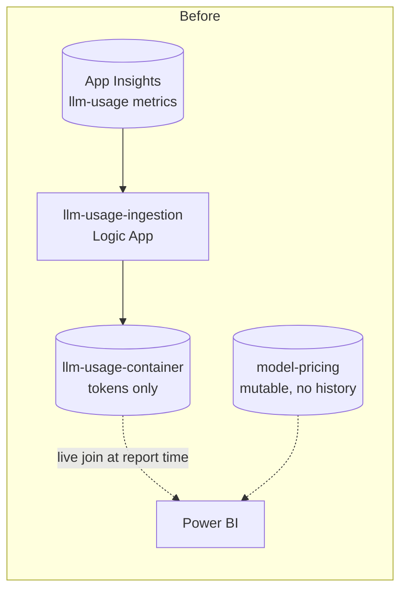
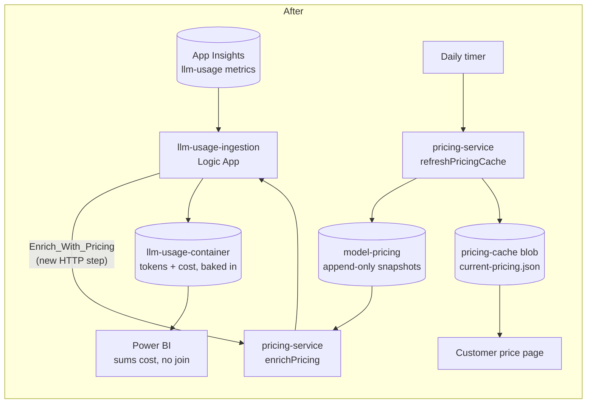

# Cost Attribution Guide (fork addition)

This guide documents a change on top of the upstream accelerator: **cost is
computed once, at ingestion, and stored on every usage record** — instead of
being computed live by Power BI joining `llm-usage-container` against
`model-pricing` on every report refresh.

Read this alongside [Platform Observability Guide](./platform-observability-guide.md)
(the existing telemetry pipeline this change modifies) and
[Power BI Dashboard Guide](./power-bi-dashboard.md) (which now documents
org/cost-center/individual-user pages built on top of the field this change
adds).

## Why

The upstream `model-pricing` container has no history — a price update
overwrites the existing document in place. Power BI joins usage against
**whatever is currently in that container** at report-refresh time, which
means: change a price today, and every historical report — including
already-closed billing periods — silently recomputes using the new price
the next time it refreshes. For a chargeback/showback platform this is a
correctness bug, not a cosmetic one.

## What changed

1. **`model-pricing` becomes append-only.** A price change writes a new
   dated snapshot (`docType: "priceSnapshot"`, `id: "{model}-v{n}"`,
   `effectiveFrom`/`effectiveTo`/`priceVersion`) — the old snapshot is
   never edited, only its `effectiveTo` is closed out. See
   `src/pricing-service/src/lib/types.ts` for the schema.
2. **A new `pricing-service` Function App** (`src/pricing-service/`) does
   the two jobs a live Power BI join used to do implicitly and incorrectly:
   - `refreshPricingCache` (daily timer) diffs your source price list
     against the latest snapshot per model, writes a new versioned
     snapshot only for models that actually changed, and refreshes a small
     cached `current-pricing.json` blob for the price page.
   - `enrichPricing` (HTTP, called once per Logic App run — not once per
     record) resolves the price **effective at each record's own
     timestamp** and returns the batch with a `cost` object merged onto
     every record.
3. **`llm-usage-ingestion/workflow.json`** gets one new step,
   `Enrich_With_Pricing`, between `Parse_Metrics_Logs` and `For_each` — the
   loop now iterates the enriched array, and `Create_Usage_Log`'s document
   template writes the `cost` object onto every Cosmos record it upserts.
4. **Power BI gets simpler.** See the Power BI guide's new "Org,
   cost-center, and individual-user pages" section — every measure now
   just sums `cost.totalCost`, no join, no retroactive drift.

## What deliberately did NOT change

**PTU / reserved-capacity (`CalculationMethod: "percentage"`) models still
get their cost computed in Power BI, not at ingestion.** Distributing a
fixed capacity cost across consumers needs each consumer's *share* of usage
over the whole billing period as the denominator — a single request being
ingested can't know that in isolation. `enrichPricing` deliberately leaves
`cost.totalCost: null` for these models (see the comment in
`src/pricing-service/src/lib/costCalculator.ts`); the existing
`percentage`-calculation-method reporting in the Power BI guide is
unchanged and still correct for them.

## Deploying this change

1. **Seed data**: `src/usage-reports/model-pricing-generated-extended.json`
   now has versioning fields; a companion
   `src/usage-reports/model-pricing-current-generated.json` provides the
   matching `current::{model}` pointer documents. Load both into
   `model-pricing` on first deploy (same manual seed step the upstream
   post-deployment guide already documents — see there for how to bulk
   import into Cosmos DB).
2. **Deploy `pricing-service`**: `bicep/infra/modules/pricing-service/pricing-service.bicep`
   provisions the Function App standalone. Wire its Cosmos/storage
   parameters into your existing orchestration alongside the `cosmos-db`
   and `logic-app` modules — see `src/pricing-service/README.md`'s
   "Not attempted here" note for why that last wiring step is left to you
   rather than guessed.
3. **Point the Logic App at it**: add two new app settings to the
   `llm-usage-ingestion` Logic App —
   `PricingService_EnrichPricingUrl` (the deployed Function's
   `enrichPricing` URL) and `PricingService_FunctionKey` (its function
   key, or switch `authLevel` to `anonymous` + network-restrict the
   Function App to the Logic App's outbound IPs / a shared VNet instead,
   consistent with how the rest of this accelerator prefers managed
   identity over shared secrets where the connector supports it).
4. **Point your price page at the cache blob**: `pricing-cache/current-pricing.json`
   in the storage account `pricing-service` writes to — serve it through
   whatever your customer-facing page already uses (a static site, an APIM
   pass-through operation, direct blob read with the container's
   `access: 'blob'` public-read setting). Refreshed once every 24h; the
   page should never query Cosmos directly.

## Operational notes

- **Missing price for a model**: `enrichPricing` doesn't fail the whole
  ingestion batch if a record's model/timestamp has no matching snapshot —
  it returns `cost.totalCost: null` and logs a warning (`context.warn`).
  Alert on that warning in production; a `null` cost silently sitting in
  reports is worse than a loud failure.
- **Backfilling history**: this change only affects records ingested
  *after* it's deployed. Existing `llm-usage-container` records have no
  `cost` field — either leave them out of cost-based measures (Power BI
  `DIVIDE`/`SUM` over a missing column returns blank, not an error) or
  run a one-off backfill job reusing `resolveEffectivePrice()` /
  `calculateCost()` from `src/pricing-service/src/lib/` against the
  historical rows.
- **`Backend ID` dimension**: the active `frag-set-llm-usage.xml`
  fragment (the only one still in the repo — see "Dead fragment cleanup"
  below) defines a `Backend ID` dimension with no explicit `value`
  attribute (relying on APIM's own automatic backend-id enrichment) —
  this change doesn't touch that fragment at all, only the downstream
  ingestion workflow and a new Function App.
- **Dead fragment cleanup**: `frag-ai-usage.xml`, `frag-llm-usage.xml`,
  `frag-openai-usage.xml`, and `frag-openai-usage-streaming.xml` have
  been removed from the repo. They were leftovers from an earlier
  telemetry design — `frag-ai-usage.xml` was still registered as a live
  APIM policy fragment resource but never `include-fragment`'d by any
  active product policy; the other three were not even registered
  anywhere. All emitted an `endUserId` field the active pipeline never
  did, which is exactly what led an earlier review of this fork to
  initially (and reasonably) suspect `endUserId` was real — a dead file
  that looks live is worse than no file at all. The active emit path has
  been `frag-set-llm-usage.xml` (capped at 6 dimensions, no `endUserId`)
  this whole time; see `guides/power-bi-dashboard.md`'s "Individual-user
  page" section for how end-user identity is actually captured today.
