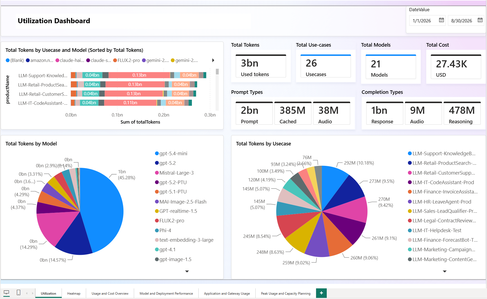
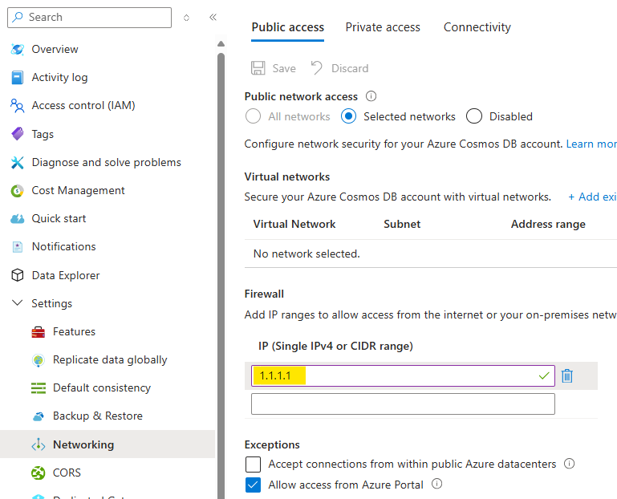
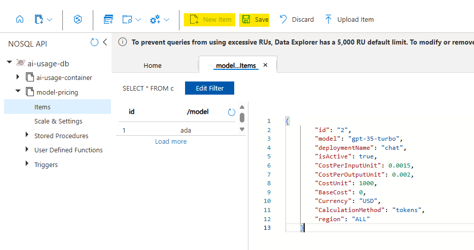
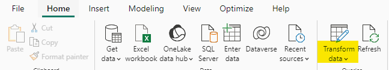
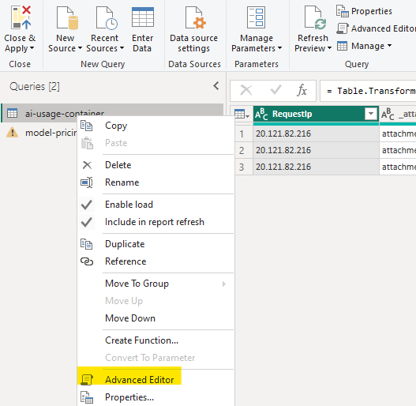
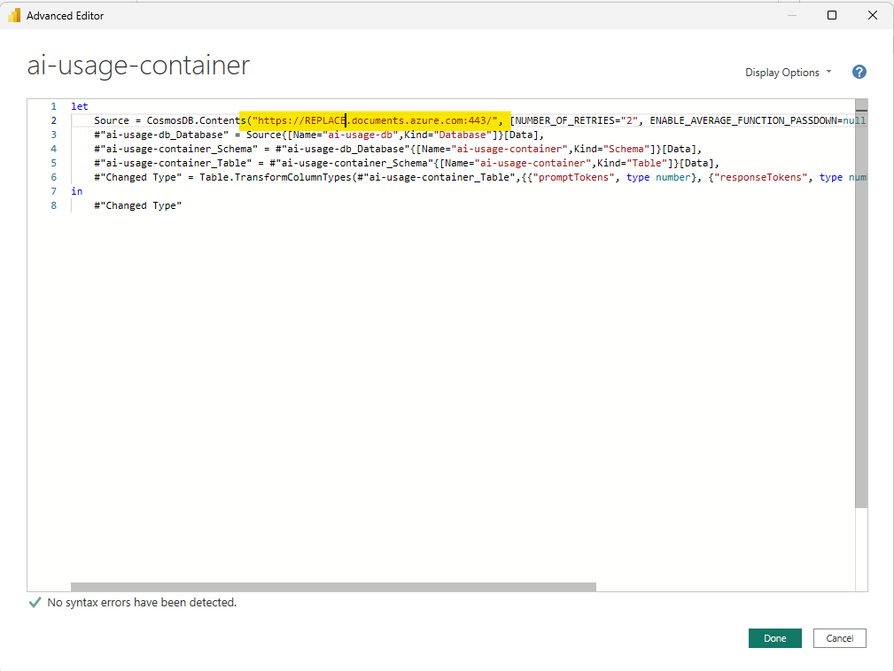
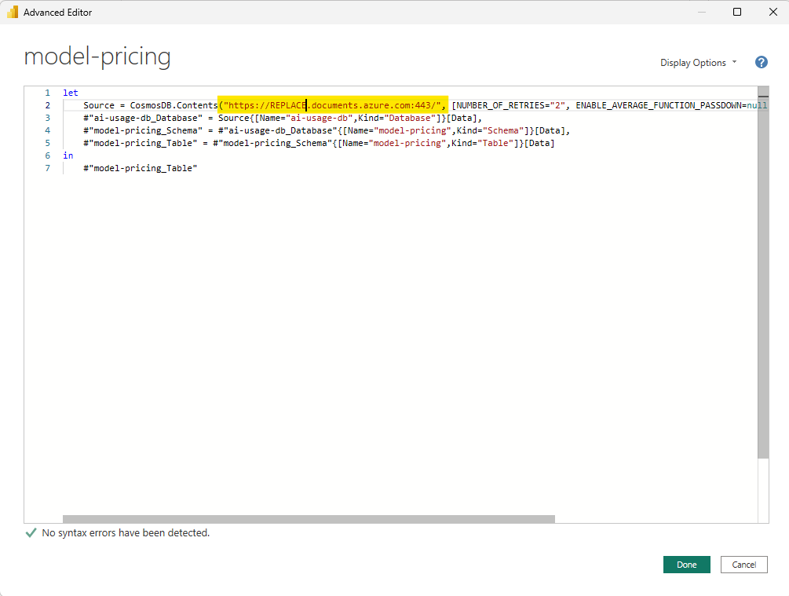
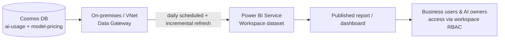

# Power BI Dashboard

Power BI is a business analytics service by Microsoft. It provides interactive visualizations and business intelligence capabilities with an interface simple enough for end users to build their own reports and dashboards.

In the Citadel Governance Hub (citadel-v1) implementation, Power BI is used to turn the **LLM usage telemetry** collected by the gateway into cost-attribution, chargeback, and FinOps reports. Usage records are streamed to Cosmos DB by the usage-ingestion pipeline and joined against a **model-pricing** reference table to calculate cost per product, model, backend, and application.



## What changed in citadel-v1

If you are coming from a previous version of the accelerator, the following changed:

| Area | Previous | citadel-v1 |
|------|----------|------------|
| Power BI template | `AI-Hub-Gateway-Usage-Report-v1-5-Incremetal.pbix` | `Citadel-Governance-Hub-Usage-Dashboard-V1.1-Incremental.pbix` |
| Usage data model | Basic token counts (`promptTokens`, `responseTokens`, `totalTokens`) plus `sessionId` / `endUserId` | Detailed token breakdown (cached, audio, reasoning, prediction) plus two generic **custom dimensions** |
| Pricing model | `CostPerInputUnit` / `CostPerOutputUnit` only | Extended per-token-type unit costs (cached, audio, reasoning, image) — see [model-pricing-generated-extended.json](../src/usage-reports/model-pricing-generated-extended.json) |
| Metadata capture | Header-based `sessionId` / `endUserId` variables | `customDimension1` / `customDimension2` configured per access contract or globally in the usage policy fragment |
| Fixed-cost services | Only token-based cost | PTU and other flat-rate services supported via the `percentage` calculation method |

## Prerequisites

- Download and install the Power BI Desktop application from the [Microsoft Store on Windows](https://www.microsoft.com/store/productId/9NTXR16HNW1T?ocid=pdpshare) or from the [App Store](https://go.microsoft.com/fwlink/?LinkId=526218&clcid=0x409) on Mac.

- Make sure you can access Cosmos DB from your local machine (you might need to allow your public IP to access Cosmos DB).



- Seed the **model-pricing** container with pricing entries. A ready-to-use sample aligned with the new data model is available at [/src/usage-reports/model-pricing-generated-extended.json](../src/usage-reports/model-pricing-generated-extended.json).



> **Note:** Pricing in the sample file is based on public Azure/model-provider list prices and is provided as a starting point. Review the pricing published for the specific service/model you use and update the `model-pricing` container accordingly.

## Understanding the data model

The dashboard is built on top of two Cosmos DB containers:

1. **llm-usage-container** — one document per LLM request, emitted by the gateway usage pipeline.
2. **model-pricing** — the reference table used to convert token counts into cost.

### LLM usage data model

Each usage record now carries a detailed token breakdown and the two custom dimensions. A representative record looks like this:

```json
{
    "id": "llm-126d96c6-575c-4d98-b6c6-006a2431db86",
    "timestamp": "7/19/2026 11:00:00 AM",
    "appId": "LLM-Testing-UniversalLLMAllModels-DEV-SUB-01",
    "productName": "LLM Testing UniversalLLMAllModels DEV",
    "deploymentName": "text-embedding-3-large",
    "backendId": "aif-dvfwtaj5al46e-1",
    "customDimension1": "",
    "customDimension2": "",
    "gatewayName": "apim-dvfwtaj5al46e",
    "gatewayRegion": "Sweden Central",
    "promptTokens": "10",
    "responseTokens": "0",
    "totalTokens": "10",
    "completionAcceptedPredictionTokens": "0",
    "completionAudioTokens": "0",
    "completionReasoningTokens": "0",
    "completionRejectedPredictionTokens": "0",
    "promptAudioTokens": "0",
    "promptCachedTokens": "0",
    "targetService": "NA",
    "model": "text-embedding-3-large",
    "aiGatewayId": "managed",
    "RequestIp": "NA",
    "operationName": "NA"
}
```

| Field | Description |
|-------|-------------|
| `id` | Unique usage record identifier. |
| `timestamp` | Time the request was processed. |
| `appId` | Application / agent identifier (falls back to the APIM subscription ID). |
| `productName` | Access contract / use case (APIM product) that served the request. |
| `deploymentName` | Model deployment name derived from the requested model. |
| `backendId` | Backend instance that processed the request. |
| `customDimension1` | **Configurable** — free-form dimension (e.g., end-user ID, sub-agent ID). See [Activating custom dimensions](#activating-custom-dimensions). |
| `customDimension2` | **Configurable** — second free-form dimension (e.g., session ID, cost center). |
| `gatewayName` / `gatewayRegion` | APIM gateway instance and Azure region. |
| `promptTokens` | Input (prompt) tokens. |
| `responseTokens` | Output (completion) tokens. |
| `totalTokens` | Total tokens for the request. |
| `promptCachedTokens` | Prompt tokens served from cache (billed at the cached rate). |
| `promptAudioTokens` | Audio input tokens. |
| `completionAudioTokens` | Audio output tokens. |
| `completionReasoningTokens` | Reasoning tokens (e.g., o-series / reasoning models). |
| `completionAcceptedPredictionTokens` | Predicted-output tokens that were accepted. |
| `completionRejectedPredictionTokens` | Predicted-output tokens that were rejected. |
| `targetService` | Target service/operation type (`NA` when not applicable). |
| `model` | Requested model name. |
| `aiGatewayId` | Gateway identity (`managed` for the managed gateway). |
| `RequestIp` | Client IP (when captured). |
| `operationName` | API operation name (when captured). |

> **Note:** The detailed token breakdown (cached, audio, reasoning, prediction) enables accurate cost calculation when the corresponding unit costs are configured in the pricing model. Where a token type does not apply, the value is `0` and contributes nothing to cost.

## Preparing the pricing model

The pricing model has been extended to price each token type independently. This is required because modern models bill cached input, audio, reasoning, and image tokens at different rates.

### Extended pricing fields

```json
{
    "id": "1",
    "modelFamily": "gpt-4.1",
    "deploymentName": "gpt-4.1",
    "isActive": true,
    "CostPerInputUnit": 2.00,
    "CostPerOutputUnit": 8.00,
    "CostPerCachedInputUnit": 0.50,
    "CostPerAudioInputUnit": 0,
    "CostPerCachedAudioInputUnit": 0,
    "CostPerAudioOutputUnit": 0,
    "CostPerReasoningOutputUnit": 8.00,
    "CostPerImageInputUnit": 0,
    "CostPerCachedImageInputUnit": 0,
    "CostUnit": 1000000,
    "BaseCost": 0,
    "Currency": "USD",
    "CalculationMethod": "tokens",
    "region": "ALL"
}
```

| Field | Description |
|-------|-------------|
| `modelFamily` | Informational/display only (e.g. `gpt-4.1`) — **not** the join key. |
| `deploymentName` | **The** join key used to price a usage record — must exactly match your real Azure deployment name, not a model family name. See "model-pricing field naming" below for why this distinction matters. |
| `isActive` | Set to `false` to retire a pricing entry without deleting it. |
| `CostPerInputUnit` | Cost per input (prompt) token unit. |
| `CostPerOutputUnit` | Cost per output (completion) token unit. |
| `CostPerCachedInputUnit` | Cost per cached input token unit (usually a large discount). |
| `CostPerAudioInputUnit` / `CostPerAudioOutputUnit` | Cost per audio input / output token unit. |
| `CostPerCachedAudioInputUnit` | Cost per cached audio input token unit. |
| `CostPerReasoningOutputUnit` | Cost per reasoning output token unit. |
| `CostPerImageInputUnit` / `CostPerCachedImageInputUnit` | Cost per image input / cached image input token unit. |
| `CostUnit` | The unit size the prices are expressed in (e.g., `1000000` = per 1M tokens). |
| `BaseCost` | Fixed cost for the entry (used by the `percentage` method — see below). |
| `Currency` | Currency code (e.g., `USD`). |
| `CalculationMethod` | `tokens` (variable, usage-based) or `percentage` (fixed-cost distribution). |
| `region` | `ALL` or a specific region for region-specific pricing. |

> **Tip:** Set the unit costs for token types your model does not use to `0`. Combined with the `0` values in the usage record, they contribute nothing to the calculated cost.

### `model-pricing` field naming — `deploymentName` is the join key, `modelFamily` isn't

Easy to get backwards, so stated plainly: `pricing-service`'s
`resolveEffectivePrice()` (`src/pricing-service/src/lib/cosmos.ts`)
matches a usage record's `deploymentName` against the price snapshot's
own `deploymentName` field — **never** `modelFamily`. `modelFamily` exists
purely for a human reading the container to know what family of model a
row prices (`gpt-4.1`, `gpt-5.1-PTU`, ...); it plays no role in pricing a
request. If you deploy a model under a different name than its official
family name (a very normal thing to do — e.g. a deployment named
`prod-gpt41-eu2` for the `gpt-4.1` family), `deploymentName` is what
must match your real Azure deployment, in both `llm-usage-container` and
`model-pricing` — `modelFamily` can be anything you find readable.

This field was renamed from `model` to `modelFamily` specifically because
the old name invited this exact confusion (a field called "model"
silently had to hold a deployment name to work at all). **Breaking
change for an already-deployed `model-pricing` container**: existing
documents have `model`, not `modelFamily` — rename that key on every
existing document (a small script against the container, or a manual
edit via Cosmos Data Explorer for a small catalog) as part of applying
this change. The join itself was always keyed on `deploymentName` in
practice (every shipped example set `model` and `deploymentName` to the
same string), so this rename does not change what actually prices a
request — only what the informational field is called.

### Handling PTU and other fixed-cost services

Some AI services are billed at a **flat, fixed rate** regardless of per-request token consumption — for example **Provisioned Throughput Units (PTU)**, reserved capacity, or a fixed-tier Azure AI Search service. For these, per-token pricing does not reflect reality: you pay the same monthly amount whether you send one request or one million.

To account for these in the dashboard, use the **`percentage`** calculation method. Instead of multiplying tokens by a unit price, the report **distributes the fixed `BaseCost` proportionally** across every consumer, based on each consumer's share of usage. This enables showback/chargeback of a fixed cost across the products and applications that actually used the capacity.

The last two entries in [model-pricing-generated-extended.json](../src/usage-reports/model-pricing-generated-extended.json) illustrate a PTU deployment:

```json
{
    "id": "19",
    "modelFamily": "gpt-5.1-PTU",
    "deploymentName": "gpt-5.1-PTU",
    "isActive": true,
    "CostPerInputUnit": 0,
    "CostPerOutputUnit": 1,
    "CostPerCachedInputUnit": 0,
    "CostPerAudioInputUnit": 0,
    "CostPerCachedAudioInputUnit": 0,
    "CostPerAudioOutputUnit": 0,
    "CostPerReasoningOutputUnit": 0,
    "CostPerImageInputUnit": 0,
    "CostPerCachedImageInputUnit": 0,
    "CostUnit": 1000000,
    "BaseCost": 11000,
    "Currency": "USD",
    "CalculationMethod": "percentage",
    "region": "ALL"
}
```

How the `percentage` method works for this entry:

- **`CalculationMethod` = `percentage`** tells the report to distribute a fixed cost rather than price tokens individually.
- **`BaseCost` = `11000`** is the total fixed monthly cost of the PTU reservation (the amount to be spread across all consumers).
- **`CostPerOutputUnit` = `1`** (with all other unit costs `0`) turns output tokens into the **weight** used for distribution. Each record's weight = its output tokens × 1, so a consumer that generated 30% of the PTU deployment's total output tokens is allocated 30% of the `$11,000`.
- **Total tokens / output set to `1`** as the weighting means the split is driven purely by relative usage volume — no consumer is charged more than the fixed `BaseCost` in aggregate.

> **Note:** You can weight the distribution on a different token type by placing the `1` on the corresponding unit-cost field (e.g., `CostPerInputUnit` to split by prompt volume). Keep exactly one unit cost set to `1` and the rest at `0` so the split reflects a single, well-defined usage measure.

The same technique applies to any fixed-cost service (reserved Azure AI Search, dedicated capacity, etc.): set `CalculationMethod` to `percentage`, put the flat monthly amount in `BaseCost`, and choose one usage measure as the distribution weight.

## Preparing the Power BI Dashboard

Open [src/usage-reports/Citadel-Governance-Hub-Usage-Dashboard-V1.1-Incremental.pbix](../src/usage-reports/Citadel-Governance-Hub-Usage-Dashboard-V1.1-Incremental.pbix) in Power BI Desktop.

Because the report uses import mode, you should see sample data from a previously connected data source. To point it at your deployment, update the Cosmos DB connection.

1. Click **Transform Data** in the Home tab.

    

2. Right-click the **llm-usage-container** query and select **Advanced Editor**.

    

3. Replace the Cosmos DB endpoint with the one you deployed.

    

4. Repeat the same for the **model-pricing** query.

    

5. Click **Refresh Preview** to force Power BI to reload the data.

6. Click **Close & Apply** to save the changes.

7. You should now see data from your Cosmos DB in the report.

    

8. To pull a fresh copy of the data later, click **Refresh** in the Home tab.

### Verifying the data relationship

The report joins **llm-usage-container** to **model-pricing** on the `deploymentName` column (many-to-one). If you added new pricing entries or renamed deployments, confirm the relationship is intact under **Modeling → Manage relationships**.

## Activating custom dimensions

The usage data model exposes **two generic custom dimensions** — `customDimension1` and `customDimension2` — that let an organization track any additional context alongside usage (for example **end-user ID**, **session ID**, **sub-agent ID**, **cost center**, or **department**). By default both are empty (`NA`), and they only appear in the dashboard once you populate them.

The gateway emits these dimensions from the `frag-set-llm-usage` policy fragment, which reads the `customDimension1` and `customDimension2` context variables:

```xml
<!-- CUSTOM DIMENSIONS: Allows defining additional context for LLM usage -->
<dimension name="customDimension1" value="@((string)context.Variables.GetValueOrDefault<string>("customDimension1", "NA"))" />
<dimension name="customDimension2" value="@((string)context.Variables.GetValueOrDefault<string>("customDimension2", "NA"))" />
```

There are two ways to set these variables, depending on whether the mapping is per use case or global.

### Option 1 — Per access contract (recommended)

Set the variables in the **inbound** section of the product (access contract) policy. This lets each use case decide what business context to capture, typically from request headers sent by the client application:

```xml
<inbound>
    <base />
    <!-- Map customDimension1 from a client header (e.g., end-user ID) -->
    <set-variable name="customDimension1" value="@(
        context.Request.Headers.GetValueOrDefault("x-enduser-id", "anonymous-enduser")
    )" />

    <!-- Map customDimension2 from a client header (e.g., session ID) -->
    <set-variable name="customDimension2" value="@(
        context.Request.Headers.GetValueOrDefault("x-session-id", "NA-session")
    )" />
</inbound>
```

> See [Citadel Access Contracts Policy — LLM Usage Custom Dimensions](../bicep/infra/citadel-access-contracts/citadel-access-contracts-policy.md#llm-usage-custom-dimensions-policy) for the full per-use-case configuration reference.

### Option 2 — Global default in the usage fragment

If a dimension has the same meaning across every use case, embed the default directly in the `frag-set-llm-usage.xml` policy fragment instead of repeating it in each access contract. Set the variable just before the `<llm-emit-token-metric>` block (or change the fallback used by the `<dimension>` element). This value applies to all products unless a specific access contract overrides it with its own `set-variable`.

> **Note:** `llm-emit-token-metric` supports a limited number of custom dimensions. The two generic dimensions are provided precisely so you can carry organization-specific context without exceeding that limit. Keep dimension **cardinality** in mind — very high-cardinality values (like raw user IDs on high-traffic products) increase metric storage and query cost.

Once populated, `customDimension1` and `customDimension2` flow through to Cosmos DB and become available as slicers and grouping columns in the Power BI report, exactly like `productName` and `deploymentName`.

## Org, cost-center, and individual-user pages (this fork's addition)

> **Note on how to apply this section:** the `.pbix` is a binary file, so
> everything below is a set of manual steps to perform in Power BI Desktop
> — there's no source diff to apply. See `guides/cost-attribution-guide.md`
> for the ingestion-side change (per-record `cost` field) these pages are
> built on. **The actual paste-in kit — every measure, column, and RLS
> role described below and in the rest of this fork's Power BI additions
> — lives at [`powerbi-report-kit/`](../powerbi-report-kit/) in this
> repo** (22 files, `00-README.md` has the file table and order of
> operations). This section of the guide is the narrative walkthrough;
> the kit is what you actually paste into Power BI Desktop.

Once `llm-usage-container` records carry a `cost` object on every row (see
the cost-attribution guide), reporting gets simpler, not more complex: no
more live join against `model-pricing` to compute a number — every measure
below just sums a field that's already on the row. `model-pricing` remains
useful (it's what `pricing-service` reads to write that field, and it still
backs the standalone price-catalog page), but it's no longer on the report's
critical path for chargeback numbers.

### New measures (add to the `llm-usage-container` table)

```dax
Total Cost = SUM('llm-usage-container'[cost.totalCost])
Total Tokens = SUM('llm-usage-container'[totalTokens])
Cost per 1K Tokens = DIVIDE([Total Cost] * 1000, [Total Tokens])

-- Month-end forecast: current month's daily run-rate projected across the
-- full month. Straightforward now that cost lives on every row instead of
-- needing a live pricing join to compute — swap for a better model
-- (weighted trailing average, seasonality) once you have more history.
Days Elapsed This Month = DATEDIFF(STARTOFMONTH(MAX('llm-usage-container'[timestamp])), MAX('llm-usage-container'[timestamp]), DAY) + 1
Days In Month = DAY(EOMONTH(MAX('llm-usage-container'[timestamp]), 0))
Forecast Month-End Cost = DIVIDE([Total Cost], [Days Elapsed This Month]) * [Days In Month]
```

### Org page

One page, no RLS restriction beyond the **Admin**/**Executive** roles below:
total cost/token trend over time (line chart by day, `Total Cost` /
`Total Tokens`), breakdown by `productName` and `deploymentName` (stacked
bar), and a KPI tile for `Forecast Month-End Cost` against a budget value
you maintain as a small manual table (`Budgets[costCenter, monthlyBudget]`)
joined on cost center for a "% of budget consumed" gauge.

### Cost-center page

Requires cost center to actually be populated on every request. Use
**Option 2** above (embed the default directly in
`frag-set-llm-usage.xml`) to set `customDimension1` to a cost-center value
**globally**, rather than Option 1's per-access-contract `set-variable` —
that guarantees every request carries a cost center instead of depending
on each access-contract owner remembering to set one.

Add a page filtered/sliced by `customDimension1` (renamed `Cost Center` in
the model for readability: right-click the column → **Rename**), with the
same cost/token trend and product/model breakdown as the org page, scoped
to one cost center at a time via a slicer.

### Individual-user page

Uses `customDimension2` — the fragment is capped at 6 dimensions and
already full (`productName`, `deploymentName`, `Backend ID`, `appId`,
`customDimension1`, `customDimension2`), so there's no 7th slot to add a
dedicated field. `frag-set-llm-usage.xml` now defaults `customDimension2`
**globally** (the same Option 2 pattern already used for
`customDimension1`/cost-center): when an access contract hasn't already
set it to something else, it resolves a UPN-shaped claim
(`preferred_username`, then `upn`, then `email`) from the caller's
validated JWT. **Deliberately not the `oid` claim** — Power BI's RLS only
exposes `USERPRINCIPALNAME()`/`USERNAME()` (both UPN-shaped) to a role
filter, with no way to compare against a raw GUID, so an oid-keyed
default would leave the Employee role below matching nobody. **Read the
cardinality warning above first** if your product is high-traffic — a
UPN on every metric row is still a real-identity value, same
cardinality-cost tradeoff as any other high-cardinality dimension. A
request with no validated JWT (API-key-only traffic) still gets `"NA"`
here — an honest limitation, not a bug: there is no UPN-bearing claim to
resolve without a JWT. A personal "my usage" page then filters
`llm-usage-container` to the signed-in user's `customDimension2` via RLS
(below), not a slicer, so a user can never browse someone else's usage
by changing a filter value.

### Row-level security (RLS)

The existing guidance in this doc only points at the [RLS
docs](https://learn.microsoft.com/power-bi/enterprise/service-admin-rls) in
passing — this fork adds the concrete roles referenced in the EAG PRD
(FR-018/019/020) so reporting can actually be handed to non-admin users:

In **Modeling → Manage roles**, create:

| Role | DAX filter (on `llm-usage-container`) | Maps to |
| --- | --- | --- |
| `Employee` | `[customDimension2] = USERPRINCIPALNAME()` | Employee — sees only their own usage. **Not** `[appId]` — that field holds an APIM subscription id/custom app string, never a UPN |
| `BudgetHolder` | `[customDimension1] IN AuthorizedCostCenters` (a small table you maintain mapping UPN → cost center(s), joined and referenced from the role filter) | Budget Holder — sees their assigned cost center(s) only |
| `Admin` / `Executive` | `TRUE()` (no filter) | Platform Administrator / Executive — org-wide |

This mirrors the "Power BI RLS as security boundary" decision from the EAG
architecture docs this fork's design is based on — one semantic model,
three roles, no duplicated reports. Test each role with **View As Roles** before publishing,
then assign Entra ID security groups to the matching role once the report
is in the Power BI Service (**Security** in the workspace dataset settings)
— group-based assignment, not individual users, so a person's report access
follows their group membership instead of a manual per-user Power BI step.

## Publishing to the Power BI Service and scheduling refresh

Working with the `.pbix` in Power BI Desktop is ideal for development and one-off analysis, but it is **not** how the report should be consumed day to day. The **recommended production approach** is to publish the report to a **Power BI workspace on [PowerBI.com](https://app.powerbi.com)** and let the service keep it up to date automatically by syncing from Cosmos DB on a schedule through a **data gateway**.



### 1. Publish the report to a Power BI workspace

From Power BI Desktop, sign in with your organizational account and use **Home → Publish** to upload the report to a dedicated workspace (for example, *AI Citadel Governance – Usage*). Use a workspace rather than *My workspace* so it can be governed and shared.

📖 Reference: [Publish datasets and reports from Power BI Desktop](https://learn.microsoft.com/power-bi/create-reports/desktop-upload-desktop-files)

### 2. Install and configure a data gateway

The dataset imports data from **Azure Cosmos DB**, so the Power BI Service needs a **data gateway** to reach it during scheduled refresh:

- Use an **[on-premises data gateway (standard mode)](https://learn.microsoft.com/power-bi/connect-data/service-gateway-onprem)** installed on a VM that has network access to Cosmos DB, **or**
- Use a **[virtual network (VNet) data gateway](https://learn.microsoft.com/data-integration/vnet/overview)** when Cosmos DB is locked down to a private endpoint / VNet (no VM to manage).

After the gateway is installed, in the workspace dataset **Settings → Gateway and cloud connections**, map the Cosmos DB data source to the gateway and supply its connection credentials.

### 3. Enable incremental refresh and a daily schedule

The provided template (`Citadel-Governance-Hub-Usage-Dashboard-V1.1-Incremental.pbix`) is designed for **incremental refresh** — only new/changed usage partitions are refreshed instead of reloading the full history, which keeps refreshes fast and cost-efficient as usage grows.

1. Confirm the incremental refresh policy on the **llm-usage-container** table (configured via the `RangeStart` / `RangeEnd` parameters in Power BI Desktop before publishing).
2. In the workspace, open the dataset **Settings → Refresh** and set a **scheduled refresh** (a **daily** cadence is recommended for cost-attribution/FinOps reporting).

📖 References: [Incremental refresh overview](https://learn.microsoft.com/power-bi/connect-data/incremental-refresh-overview) · [Configure scheduled refresh](https://learn.microsoft.com/power-bi/connect-data/refresh-scheduled-refresh)

### 4. Manage access with workspace RBAC

Control who can view or edit the report through **Power BI workspace roles** (Admin, Member, Contributor, Viewer). Grant **Viewer** to the business users and **AI owners** who consume the dashboard, and reserve Admin/Member for the platform/reporting team. Prefer assigning roles to **Microsoft Entra ID security groups** rather than individuals for easier governance, and combine with [row-level security (RLS)](https://learn.microsoft.com/power-bi/enterprise/service-admin-rls) if different teams should only see their own products/use cases.

📖 Reference: [Roles in workspaces in Power BI](https://learn.microsoft.com/power-bi/collaborate-share/service-roles-new-workspaces)

## A starting point, not a finished product

> **Important:** the dashboard shipped with this accelerator is a **starting point** — a reference model that demonstrates how gateway usage telemetry can be turned into cost-attribution and FinOps insights. It is **not** intended to be the final reporting solution.

Every organization has different reporting needs, KPIs, and audiences. Designing and maintaining the dashboards that represent your specific **business requirements** and serve your **AI owners, FinOps, and platform stakeholders** is the customer's responsibility. Treat the provided model and visuals as a foundation to **extend, restyle, and adapt** — add your own measures, slicers (including the custom dimensions above), and pages to match how your organization governs and charges back AI consumption.