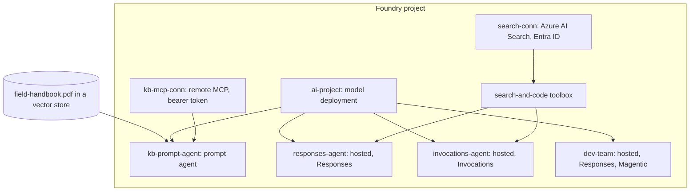
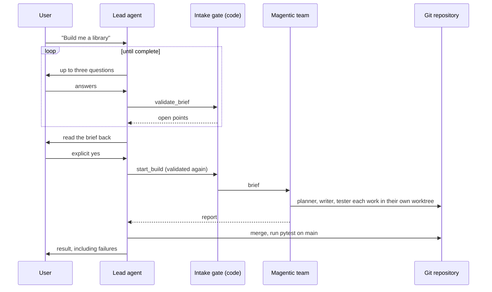

# Architecture

## Deployed resources

## Which agent to use

| Need | Agent | Why |
| --- | --- | --- |
| Answer from a PDF and one MCP server, nothing custom | `kb-prompt-agent` | No code to run or patch. |
| OpenAI-compatible chat with tools | `responses-agent` | Foundry keeps history and streaming. |
| Your own JSON contract | `invocations-agent` | Pydantic validates the payload and OpenAPI is generated. |
| Multi-step work with several specialists | `dev-team` | Magentic coordination plus git isolation. |

## dev-team flow

### Why the lead is separate from the Magentic manager

The Magentic manager plans and routes. It has no tools. The agent that talks to the user, owns
the interview and runs commands is therefore the lead. The gate is code, so a model cannot
skip the interview by deciding it already knows enough.

### Who may write what

| Role | Owns |
| --- | --- |
| lead | `docs/brief.md`, `README.md` |
| planner | `docs/requirements.md`, `docs/tasks.md`, `docs/architecture.md`, `docs/guides/` |
| writer | `src/`, `pyproject.toml` |
| tester | `tests/`, `docs/testing.md` |

Ownership is enforced in code. The shell tool cannot write files, so the only write path is the
checked one. Distinct paths mean git merges stay clean.

### Command policy

Agents get an allow-listed command line, not a shell. See `agents/dev-team/tools/shell.py`.
No push, pull, clone, remote or config. No `python -c`. No paths outside the workspace.
Children run with a scrubbed environment, so the agent's credentials are never visible to them.
