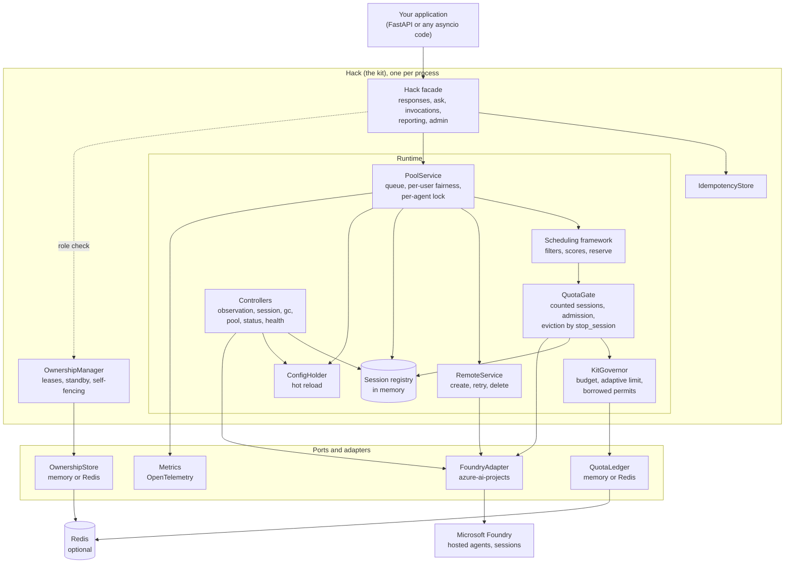
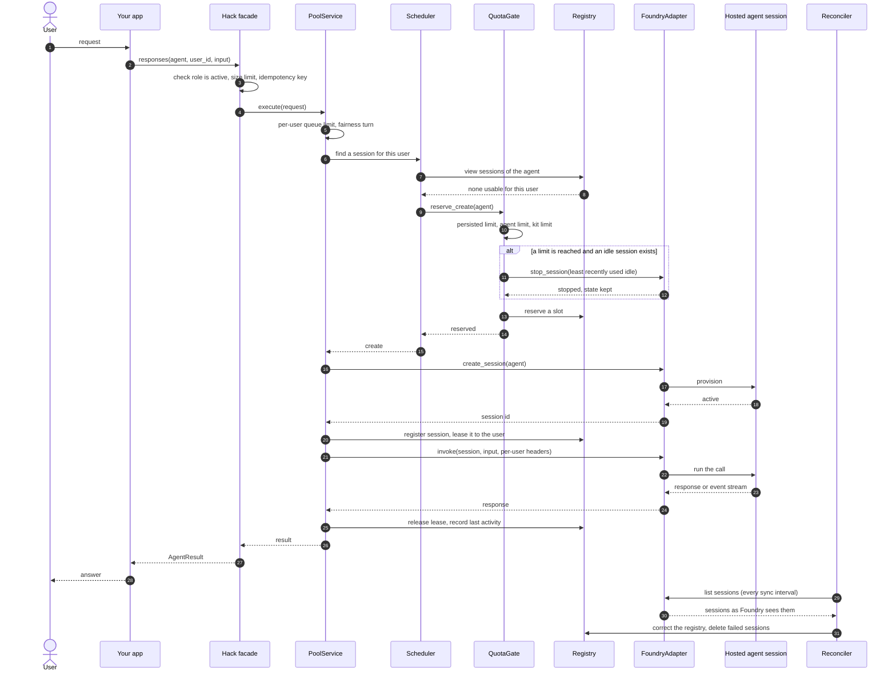
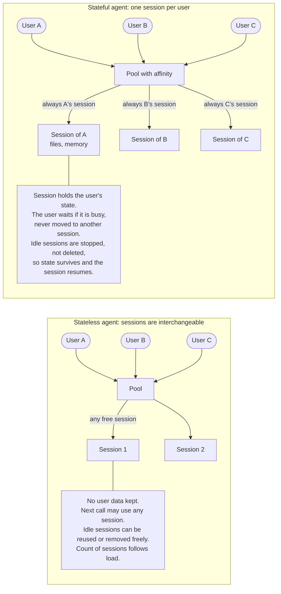
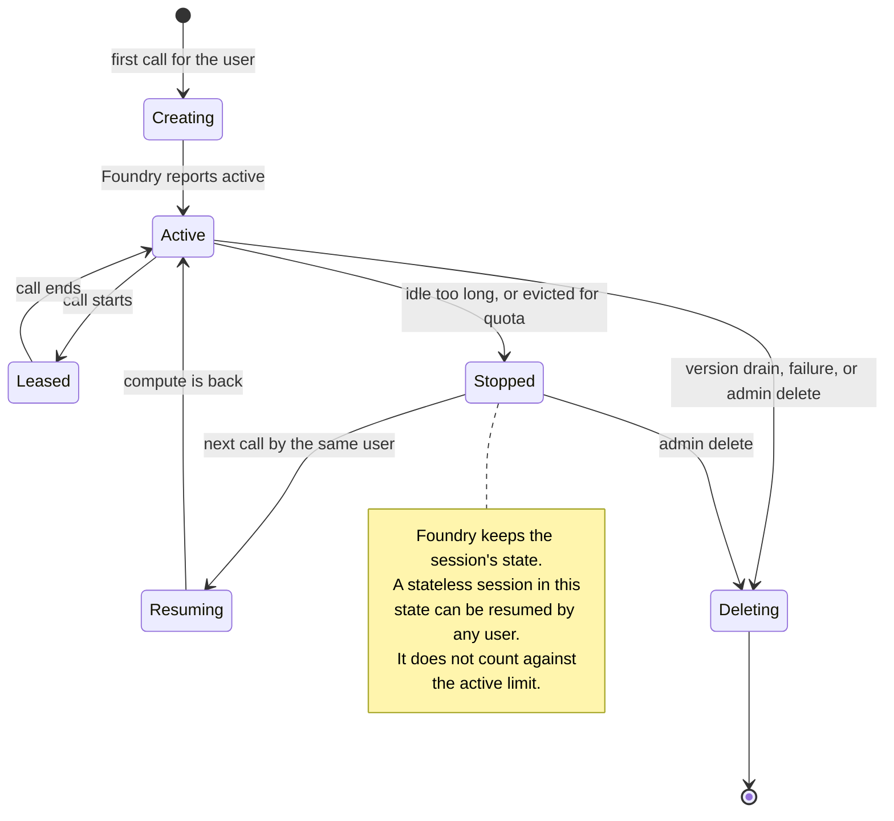
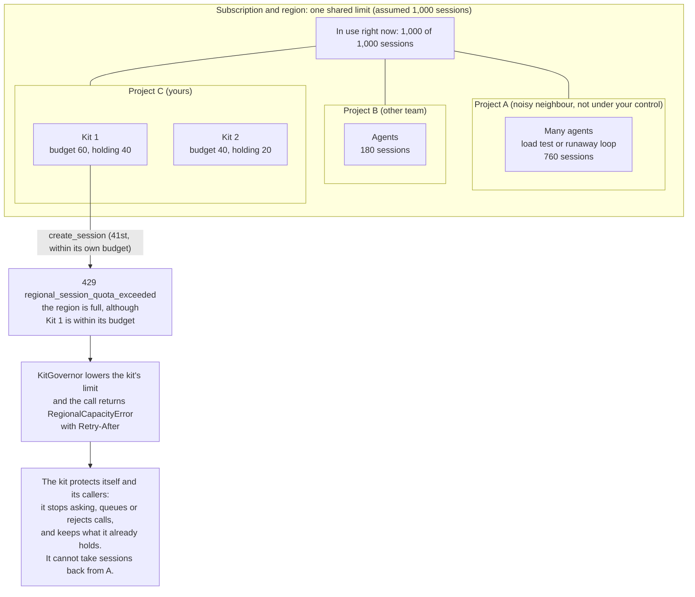
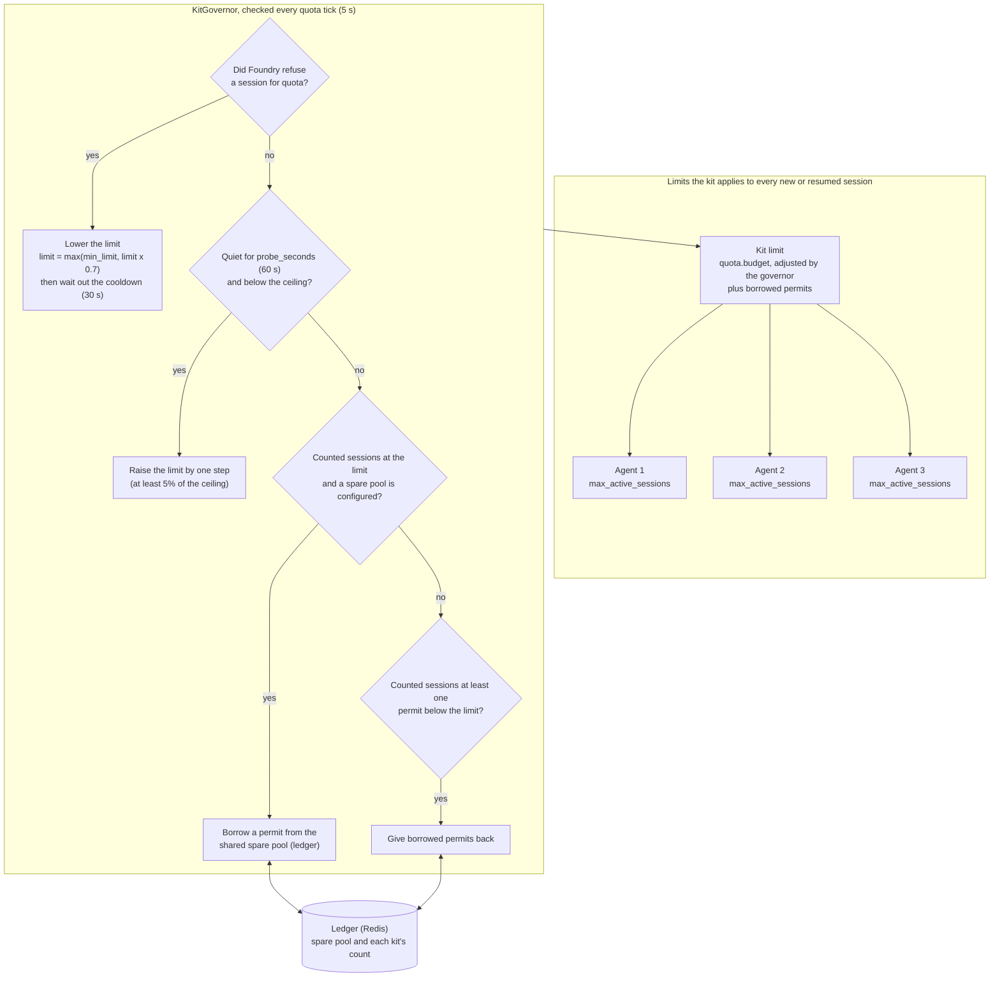
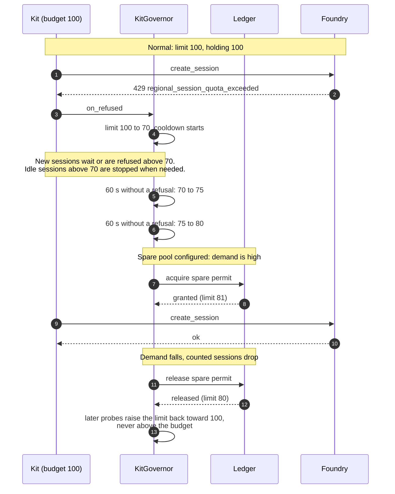

# Diagrams

Diagrams (seven pictures in five topics) of how the kit is built and how it controls session quota. GitHub renders the
Mermaid blocks, and rendered copies are in `diagrams/`. To get them into Figma, paste a block into FigJam's Mermaid import, or use the
Figma connector's `generate_diagram` tool.

The regional limit of 1,000 sessions is an assumption taken from public documentation summaries.
It is not confirmed (see `quota.md`, "Open questions").

## 1. Components

The kit runs inside your application. Everything outside the kit is behind a port, so each
adapter can be replaced or faked in tests.

## 2. A call that creates a session

A user's first call to a stateful agent. The kit admits the call, checks quota, creates the
session in Foundry, runs the call on it, and returns the session to the pool. The reconciler
works in the background and corrects the kit's view from Foundry's listing.

## 3. Stateful and stateless sessions

A stateless agent shares sessions between users and reuses any free one. A stateful agent gives
each user a session of their own and always sends that user back to it.

## 4. A shared regional limit that other projects can use up

The regional session limit belongs to the subscription and region. Every project and every kit
draws on the same number. A kit has no control over the other projects, so a "noisy neighbour"
can use most of it, and then the kit's own `create_session` calls are refused with a 429.

What the kit can and cannot do:

| The kit can | The kit cannot |
|---|---|
| Keep its own sessions within a budget, so it never uses more than its share | Stop another project from using the limit |
| Stop its own idle sessions to free compute | Reclaim sessions held by other projects |
| Lower its limit after a quota 429 and report `RegionalCapacityError` | Know the regional total without a shared ledger or a platform usage API |
| Show other kits in the same ledger and the regional total (with Redis) | See kits that do not share the ledger |

## 5. Per-agent quota and the controller that raises and lowers it

Each agent has a limit, and the kit has a total limit above them. The governor changes the
kit's limit over time. It lowers the limit after Foundry refuses a session. It raises it slowly
when there has been no refusal. With a shared ledger it can also borrow spare permits and give
them back when it no longer needs them.

The governor runs these checks independently: a refusal is handled when it happens, and the
raise, borrow and give-back checks run on each tick. The chart lists them in order only to
keep it readable.

The limit over time, for one kit with a budget of 100:

